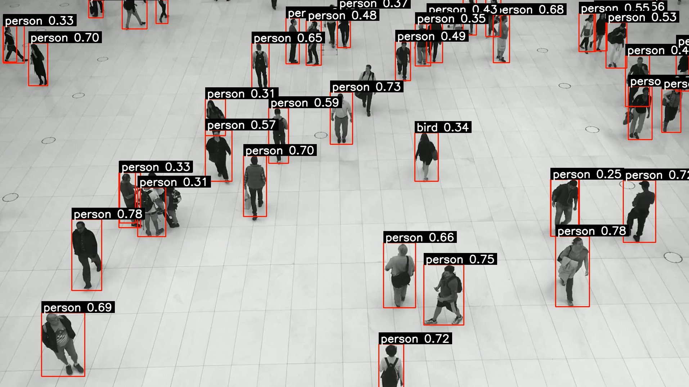
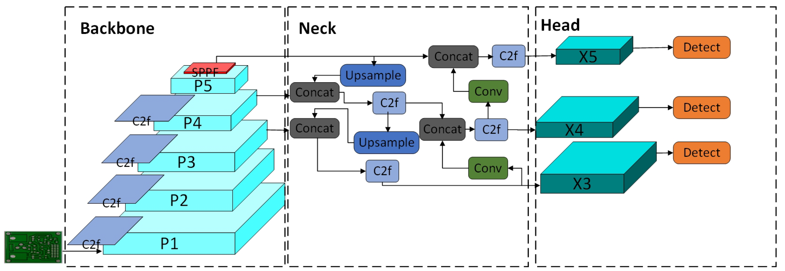
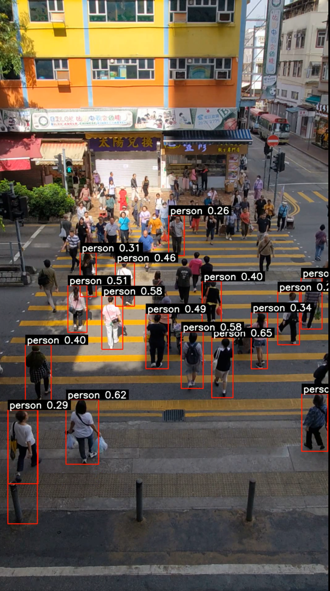
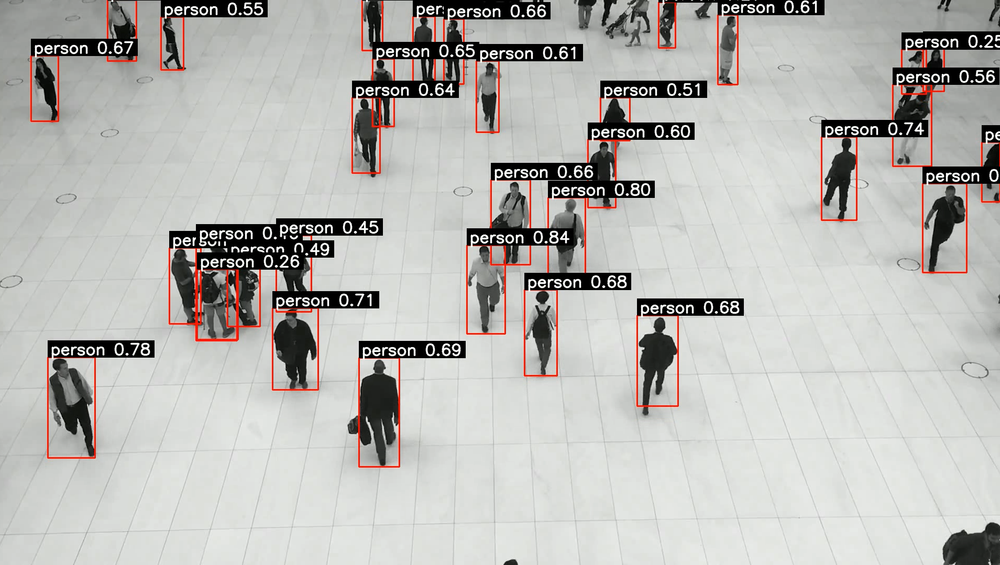

# YOLO


# YOLOv8 ile Gerçek Zamanlı Video Akışında İnsan Algılama

Bu proje, bir video akışı üzerinden **YOLOv8 nano (yolov8n) modeli** kullanarak gerçek zamanlı insan tespiti yapar ve tespit edilen nesneleri görselleştirerek çıktı video olarak kaydeder. Temel amacımız, video içerisindeki insan varlığını hızlı ve etkili bir şekilde tespit etmek ve bu süreci anlaşılır bir şekilde görselleştirmektir.

> Proje, Python dilinde geliştirilmiş olup, güçlü nesne algılama kütüphanelerini kullanmaktadır.

---

##  İçindekiler
-   [ Proje Amacı](#proje-amacı)
-   [Proje Özellikleri](#proje-özellikleri)
-   [ YOLOv8 Nano Model Nedir?](#yolov8-nano-model-nedir)
-   [ Kullanılan Teknolojiler](#kullanılan-teknolojiler)
-   [ Kurulum](#kurulum)
-   [ Kullanım](#kullanım)
-   [ Örnek Görseller](#tespit-örneği-görselleri)

---
## Proje Amacı


Bu projenin temel amacı, **YOLOv8 nano (yolov8n)** gibi modern bir derin öğrenme modelini kullanarak gerçek dünya video akışlarında insan tespiti yeteneğini sergilemektir. Özellikle:

* **Gerçek Zamanlı İnsan Tespiti:** Video kareleri üzerinde yüksek performansla insanları algılamak.
* **Görselleştirme:** Tespit edilen nesnelerin üzerine sınır kutuları ve etiketler çizerek algılama sonuçlarını anlaşılır kılmak.
* **Uygulama Alanları:** Güvenlik, trafik analizi, kalabalık yönetimi gibi çeşitli alanlarda temel bir altyapı sunmak.

---

## Proje Özellikleri

-   Belirtilen video dosyasından **kareleri okuma ve işleme**.
-   **YOLOv8 nano modeli** ile video akışında **gerçek zamanlı insan tespiti** (sadece `person` sınıfı).
-   Tespit edilen nesnelerin üzerine **sınır kutuları (bounding boxes)** ve etiketler (sınıf adı, güven skoru) çizme.
-   İşlenmiş video akışını yeni bir **MP4 dosyasına kaydetme**.
-   Sağlam **hata yönetimi** ve kaynak yönetimi (video okuma/yazma).

---

## YOLOv8 Nano Model Nedir?

**YOLO (You Only Look Once)**, gerçek zamanlı nesne algılama alanında devrim niteliğinde bir derin öğrenme modelidir. Geleneksel yöntemlerin aksine, görüntüyü tek bir geçişte işleyerek hem nesnelerin konumunu hem de sınıflarını tahmin eder, bu da onu oldukça hızlı yapar.

<small>(source: https://www.mdpi.com/2076-3417/14/17/7686)</small>

**YOLOv8 nano (`yolov8n.pt`) modeli** ise YOLOv8 serisinin en küçük ve en hızlı varyantıdır. Daha az parametreye sahip olması ve daha az hesaplama gücü gerektirmesi sayesinde, **düşük kaynaklı cihazlarda veya gerçek zamanlı uygulamalarda yüksek performans** sunar. Boyutuna rağmen, hala etkileyici bir doğrulukla nesneleri tespit edebilir. Bu projenin hızlı ve pratik bir çözüm sunabilmesi için ideal bir seçimdir.

---

## Kullanılan Teknolojiler

-   **Python:** Temel programlama dili.
-   **YOLOv8:** Gerçek zamanlı nesne algılama modeli (özellikle `yolov8n.pt` nano modeli).
-   **OpenCV (`cv2`):** Video okuma, yazma ve temel görüntü işleme operasyonları için güçlü bir kütüphane.
-   **Supervision:** Nesne algılama sonuçlarını kolayca görselleştirmek için (sınır kutuları ve etiketleme) kullanılan modern bir kütüphane.
-   **Ultralytics:** YOLOv8 modelinin kullanımı ve eğitimi için temel kütüphane.

---

## Kurulum

Projeyi yerel makinenizde çalıştırmak için aşağıdaki adımları izleyin:

1.  **Python Ortamı Oluşturma:** Python 3.8 veya üzeri yüklü olduğundan emin olun. Bağımlılık çakışmalarını önlemek için bir **sanal ortam** kullanmanız şiddetle tavsiye edilir:

    ```bash
    python -m venv venv
    # Linux/macOS için sanal ortamı etkinleştirin:
    source venv/bin/activate
    # Windows için sanal ortamı etkinleştirin:
    .\venv\Scripts\activate
    ```

2.  **Bağımlılıkların Yüklenmesi:** Gerekli tüm Python kütüphanelerini `pip` kullanarak yükleyin:

    ```bash
    pip install opencv-python ultralytics supervision
    ```

3.  **Model Ağırlıklarının İndirilmesi:** YOLOv8 nano model ağırlıkları (`yolov8n.pt`), ilk çalıştırıldığında Ultralytics kütüphanesi tarafından otomatik olarak indirilecektir. İnternet bağlantınızın olduğundan emin olun.

---

## Kullanım

## Proje Yapısı

Projenin temel dizin ve dosya yapısı aşağıdaki gibidir:

    
    .
    ├── img/                        # Uygulama ekran görüntüleri ve diğer görseller 
    ├── output/                     # İşlenmiş çıktı videolarının kaydedileceği klasör
    │   └── street_detection.mp4    # İşlenmiş örnek çıktı video
    ├── videos/                     # Giriş video dosyalarının bulunduğu klasör
    │   └── v3.mp4                  # Örnek giriş video dosyası
    ├── README.md                   # Proje açıklaması ve kullanım kılavuzu
    ├── street_person_detection    # Ana uygulama
    └── yolov8n.pt                  # YOLOv8 nano model ağırlık dosyası

    

1.  İşlemek istediğiniz video dosyasını projenizin ana dizinindeki `videos/xxx.mp4` yoluna yerleştirin. (Alternatif olarak, kod içerisindeki `video_path` değişkenini kendi video dosyanızın yolu ile güncelleyebilirsiniz.)

    **Video Kaynağı Önerisi:** Kendi videolarınız yoksa veya farklı insan videolarıyla deneme yapmak isterseniz, telifsiz ve yüksek kaliteli insan videolarını [Pexels Video Kütüphanesi](https://www.pexels.com/search/videos/human/) üzerinden edinebilirsiniz.
2.  Ana Python betiğini çalıştırın (betiğinizin adı örneğin `main_detection_script.py` ise):

    ```bash
    python main_detection_script.py
    ```

3.  İşlem tamamlandığında, algılanan insanları ve çizilen sınır kutularını içeren çıktı videosu, projenin `output/street_detection.mp4` konumunda bulunacaktır.

---
## Tespit Örneği Görselleri

### Tespit Örneği 1

*Bu görsel, modelin bir video üzerinde yaptığı insan tespitlerini ve çizilen sınır kutularını göstermektedir.*

<small>(Not:V1.mp4 uzun olduğundan tespit süresi V2.mp4 ve V3.mp4dan daha uzun sürmektedir )</small>


### Tespit Örneği 2

*Farklı bir videoda modelin algılama yeteneğini sergileyen bir örnek.*

### Tespit Örneği 3

*Farklı bir videoda modelin algılama yeteneğini sergileyen bir örnek.*

---