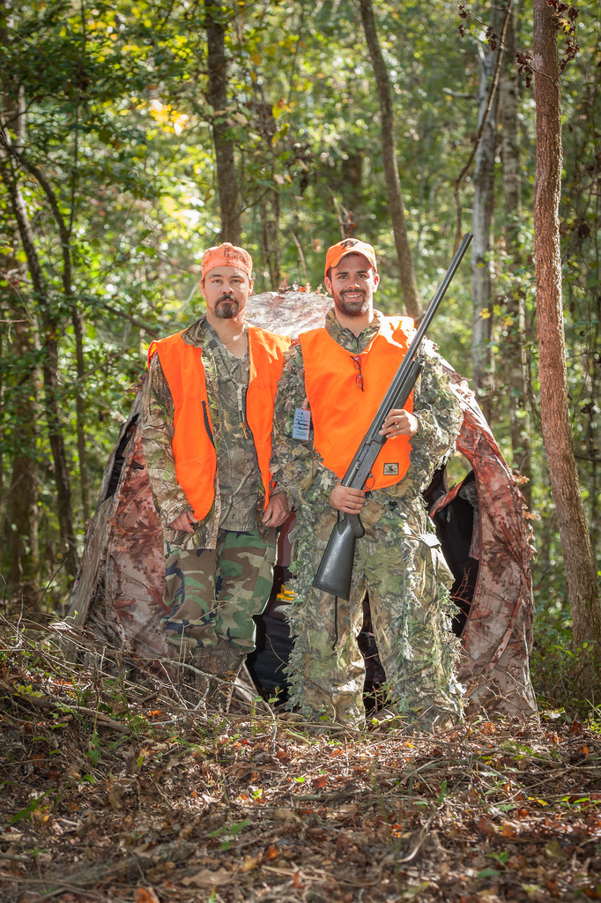
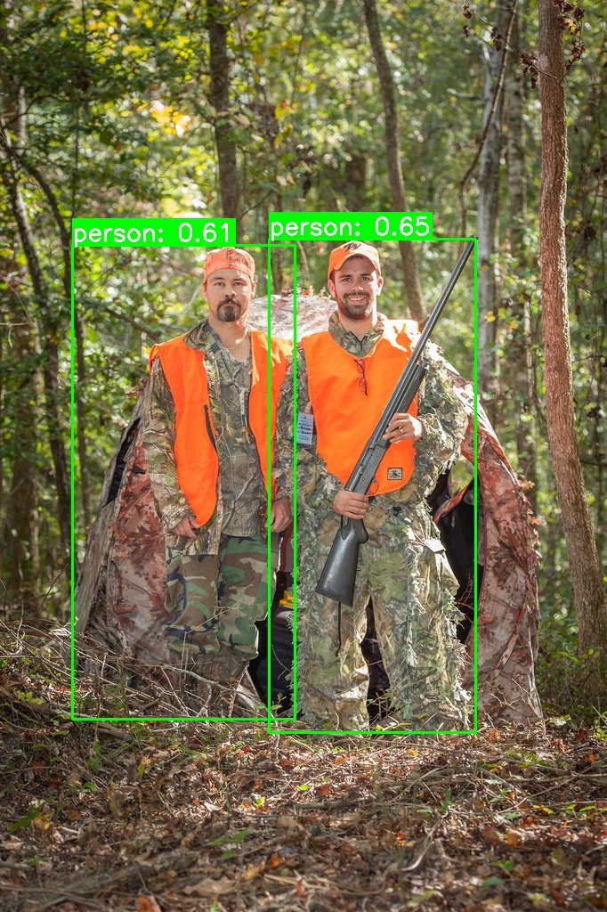

# YOLOv8 ile Görüntüde İnsan Tespiti

Bu proje, önceden eğitilmiş bir YOLOv8 modeli kullanarak resimler üzerinde insan tespiti yapmayı amaçlamaktadır. Proje, bilgisayar görüşmesi ve derin öğrenme alanında temel bilgileri olan stajyerler için pratik bir uygulama sağlamaktadır.

## Özellikler

*   **Görüntü İşleme:** Tekil resim dosyaları üzerinde tespit yapabilme.
*   **YOLOv8 Entegrasyonu:** `ultralytics` kütüphanesi aracılığıyla güçlü YOLOv8 modelinin (`yolov8s.pt`) kullanımı.
*   **İnsan Tespiti:** Tespit edilen insanlar etrafına sınırlayıcı kutular çizme ve güvenilirlik skorunu gösterme.
*   **Kullanıcı Dostu Arayüz:** Basit komut satırı argümanları ile kolay kullanım.
*   **Çıktı Kaydı:** İşlenen resimleri isteğe bağlı olarak kaydetme yeteneği.

## Örnek Sonuçlar

Aşağıda, insan tespiti öncesi ve sonrası iki görsel yan yana gösterilmiştir:

<p align="center">
  
  
</p>

## Kurulum

Projeyi yerel makinenizde çalıştırmak için aşağıdaki adımları izleyin:

1.  **Depoyu Klonlayın:**
    ```bash
    git clone https://github.com/KULLANICI_ADINIZ/yolov8-image-human-detection.git
    cd yolov8-image-human-detection
    ```
    *(NOT: Kendi GitHub kullanıcı adınızla bir depo oluşturup bu projeyi oraya yükledikten sonra bu linki kullanabilirsiniz.)*

2.  **Gerekli Klasörleri Oluşturun (Eğer yoksa):**
    ```bash
    mkdir input output src
    ```

3.  **Python Ortamı Oluşturun (Önerilir - Opsiyonel):**
    Sanal bir ortam oluşturmak, proje bağımlılıklarınızın sisteminizdeki diğer Python projeleriyle çakışmamasını sağlar.
    ```bash
    python -m venv venv
    # Windows
    .\venv\Scripts\activate
    # macOS/Linux
    source venv/bin/activate
    ```

4.  **Bağımlılıkları Yükleyin:**
    ```bash
    pip install -r requirements.txt
    ```

## Kullanım

`detect_humans.py` betiğini çalıştırmak için aşağıdaki komut satırı argümanlarını kullanabilirsiniz:

*   `--source`: Tespitin yapılacağı resim dosyasının yolu (`input/sample_image.jpg` gibi).
*   `--output` (İsteğe Bağlı): İşlenmiş çıktının kaydedileceği yol (`output/result.jpg` gibi).
*   `--conf` (İsteğe Bağlı): Tespit güvenilirlik eşiği (varsayılan: `0.5`). Bu değer 0.0 ile 1.0 arasında olmalıdır. Daha düşük bir değer daha fazla, ancak potansiyel olarak daha az doğru tespitle sonuçlanabilir.

### Örnekler:

1.  **Bir resim üzerinde insan tespiti yapma ve kaydetme:**
    ```bash
    python src/detect_humans.py --source input/sample_image.jpg --output output/detected_image.jpg
    ```

2.  **Daha düşük güvenilirlik eşiği ile test etme (örneğin 0.2):**
    ```bash
    python src/detect_humans.py --source input/sample_image.jpg --conf 0.2 --output output/detected_image_low_conf.jpg
    ```

## Ek Notlar

*   `yolov8s.pt` modeli ilk çalıştırmada otomatik olarak indirilecektir. İnternet bağlantınız olduğundan emin olun.
*   YOLOv8'in "person" sınıfının ID'si genellikle 0'dır, ancak modelin etiket listesinde bu kontrol edilmiştir.
*   Sonuç penceresi açıldığında, görüntü üzerinde tespitleri göreceksiniz. Pencereyi kapatmak ve programı sonlandırmak için herhangi bir tuşa basmanız yeterlidir.